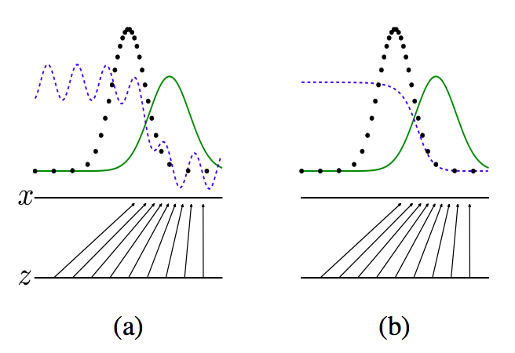
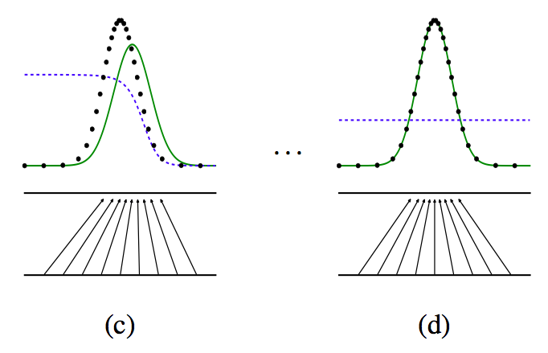

### 对抗网络

1. 基本思想

假设有一种概率分布M，它相对于我们是一个黑盒子。为了了解这个黑盒子中的东西是什么，我们构建了两个东西G和D，G是另一种我们完全知道的概率分布，D用来区分一个事件是由黑盒子中那个不知道的东西产生的还是由我们自己设的G产生的。

不断的调整G和D，直到D不能把事件区分出来为止。在调整过程中，需要：

* 优化G，使它尽可能的让D混淆。
* 优化D，使它尽可能的能区分出假冒的东西。

当D无法区分出事件的来源的时候，可以认为，G和M是一样的。从而，我们就了解到了黑盒子中的东西。

2. 简单的例子说明

且看上面四张图a,b,c,d. 黑色的点状线代表M所产生的一些数据，红色的线代表我们自己模拟的分布G，蓝色的线代表着分类模型D。

a图表示初始状态，b图表示，保持G不动，优化D，直到分类的准确率最高。
c图表示保持D不动，优化G，直到混淆程度最高。d图表示，多次迭代后，终于使得G能够完全你和M产生的数据，从而认为，G就是M。

3. 形式化

将上述例子所描述的过程公式化，得到如上公式。公式中D(x)表示x属于分布M的概率，因而，优化D的时候就是让V(D,G)最大，优化G的时候就是让V(D,G)最小。

其中，x~pdata(x) 表示x取自真正的分布。
z~pz(z) 表示z取自我们模拟的分布。G表示生成模型，D表示分类模型。
