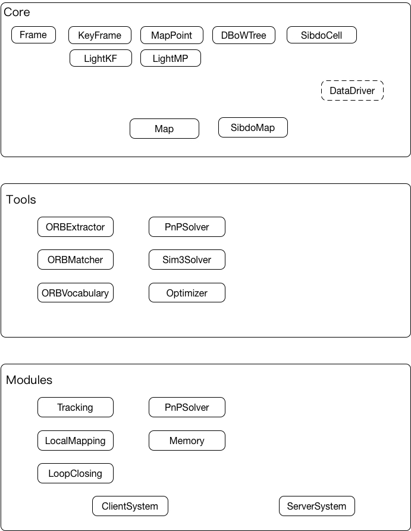

## 系统设计

这是融合数据管理和多机器人协同SLAM的系统的详细设计文档，

### 系统的要求，限制，系统的假设

目标：解决多机器人定位的问题，可以使用预先创建的地图

系统资源开销尽可能的小，最好能够封装成函数库的形式，提供接口可以被调用，其中包含

重用ORB-SLAM中的线程模块（tracking， localmapping， loopclosing）

模块封装好，模块之间的较小依赖

SLAM库，主要包括两个命名空间，client + server

SLAM库中的传输应该使用虚函数，实例化去继承，与ROS能够独立出来

是一个lifelong mapping 的问题，其中涉及到了 pre-existing map 问题

### 特征选择

使用ORB特征，ORB特征的使用包含在整个的SLAM系统中，ORB特征的相关计算模块主要包括：
  * ORB特征提取，算法详细过程[戳链接](http://m.blog.csdn.net/zouzoupaopao229/article/details/52625678)

    *class:* ORBextractor *Dependency:* opencv, std::vector

  * ORB特征匹配

    *class:* ORBmatcher *Dependency:* opencv, Mappoint, frame

  * ORB Vocabulary

    *class:* ORBVocabulary *Dependency:* DBoW2

    ORB Vocabulary主要是用于做闭环检测，离线对大量图像产生的ORB特征进行

### 1. 数据结构设计

* 帧（Frame）

* 关键帧（KeyFrame）

* 地图点（MaoPoint）

* 地图（Map）

* cell地图（SibdoMap）

### 单SLAM（系统状态机，选做）

在server不可用的时候可以自己在内存中创建地图，需要提供机制去进行状态的选择。

单SLAM保留原ORB-SLAM中的各种模块的方法，增加了Memory类进行统一的数据管理

Memory类：用于SLAM端进行独立的数据管理，
  * 提供tracking，localmapping，loopclosing模块需要的地图数据访问的接口，有清晰的数据访问接口。
  * 提供数据管理的模块，
    使用轮询机制，检测系统的工作网格是否发生了变化，如果变化那么需要进行数据的调度

### 地图

* 构成（clientMap, ServerMap）
  - KeyFrame
  - Mappoint
  - DBoWtree

* 初始化
  - SLAM初始化自己的地图，有自己的reference keyframe，不同的参考坐标系，丰富自己的地图
  - server端会为每个SLAM创建一个局部地图，同时会将地图存储进入数据库，存入数据库中的策略：要有一个缓冲的概念，

* 客户端地图的更新
  - 新创建地图元素（关键帧、地图点），会传输图像和特征点的特征描述（ORB描述和DBoW描述算子）
  - 更新的原子操作，编码操作，更新的类型包括：（1）位姿的变化（2）keyframe、mappoint删除（3）keyframe和mappoint之间的观测、关联关系的变化

* 地图融合算法：
  - 现有的条件是：DBoWtree中存储keyframe于ORB特征之间的索引，
  - 简单的策略：遍历寻找相似关键帧，与闭环检测相类似，论文中实现的策略

### 数据管理方法的设计

用网格的方法去实现，可以对数据结构进行一定程度的改变，网格地图由不同的cell单元格组成，
在SLAM端，会存储局部地图，保持部分cell在单元格中，
在server端，会存储全局的地图，

* cell 单元格： 组成网格的数据单元，是进行数据调度的最小单元，SLAM和server端中使用的是同一种cell单元格，保持地图的完整性
  - Keyfrane cell
    - 存储cell中的keyframe的ID list
    - 支持进行动态的变化，在keyframe中的位姿发生变化的时候，
  - Mappoint cell

* server中的keyframe和mappoint的位姿进行变化的时候，会更新对应的cell单元格

* cell地图（包含全局的地图信息）
  - server端的数据是通过cell单元格进行组织的，但是在数据库中，需要单独存储对全局地图中的cell单元格，以及整个cell地图的配置信息。

### 数据的传输

数据传输主要是通过DBDriver类实现的，对数据进行封装，然后通过ROS进行数据的传输。

  * SLAM -> server（new created）
  * SLAM -> server（updated）
  * server -> SLAM (cell单元格)

### 地图优化

地图的优化策略，只能更新

### 词袋的作用，因为其太消耗运行时的内存空间，可以通过增加计算时间或者降低匹配的成功率来替代。

检索相似关键帧，并且计算关键帧之间的相似度

### 预先地图数据加载与调度
